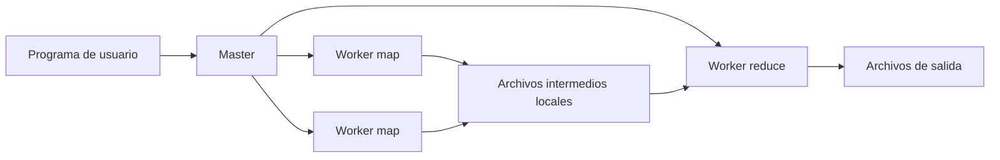

# Sistemas Distribuidos — MapReduce y procesamiento distribuido

## [Apuntes de Emma](https://drive.google.com/file/d/1kLjeiW77cAGTCqIfxOtwWB5KTHvVQu68/view)

## 1. Cronología e ideas de base

El estudio de sistemas distribuidos se apoya en una serie de problemas clásicos que aparecen desde los fundamentos teóricos de los años 70 y 80 hasta los sistemas de procesamiento masivo de datos de los años 2000.

En una máquina aislada suele asumirse que existe una memoria compartida y un reloj local suficientemente confiable para ordenar eventos. En un sistema distribuido esas dos hipótesis dejan de ser válidas:

- No hay una memoria única compartida por todos los procesos.
- No hay un reloj global perfectamente sincronizado.
- La comunicación ocurre mediante mensajes.
- Los mensajes tienen latencia, pueden llegar tarde, duplicarse o perderse.
- Cada nodo observa solo una parte del sistema.

Esto obliga a estudiar nociones como causalidad, orden de eventos, relojes lógicos, consenso, fallas parciales y coordinación.

Leslie Lamport aparece como una figura central en estos fundamentos. Sus trabajos ayudan a formalizar cómo razonar sobre el orden de eventos en sistemas donde no existe un reloj global confiable.

## 2. Fundamentos teóricos de los sistemas distribuidos

### Causalidad y orden de eventos

En un sistema distribuido no alcanza con preguntar “qué pasó primero” mirando la hora de cada máquina, porque los relojes físicos pueden estar desincronizados. En cambio, se necesita razonar sobre causalidad.

Un evento puede causar otro si existe una relación observable entre ambos. Por ejemplo:

1. Un proceso ejecuta una operación local.
2. Luego envía un mensaje.
3. Otro proceso recibe ese mensaje.
4. A partir de ese mensaje ejecuta otra operación.

En ese caso, el envío del mensaje ocurrió antes que su recepción desde el punto de vista causal.

La relación de “ocurrió antes” permite ordenar parcialmente los eventos de un sistema. No todos los eventos son comparables: si dos procesos hacen operaciones independientes y no intercambian mensajes, puede no existir información suficiente para decir cuál ocurrió primero en términos causales.

### Relojes lógicos y vectoriales

Para representar el orden causal se utilizan relojes lógicos. Un reloj lógico no busca medir segundos reales, sino capturar relaciones de precedencia entre eventos.

Los relojes de Lamport permiten establecer un orden consistente con la causalidad: si un evento `a` causa un evento `b`, entonces el timestamp lógico de `a` será menor que el de `b`. Sin embargo, que un timestamp sea menor no implica necesariamente causalidad directa.

Los relojes vectoriales agregan más información. Cada proceso mantiene un vector con contadores asociados a los procesos del sistema. Esto permite distinguir mejor entre eventos causalmente relacionados y eventos concurrentes.

### Consenso y orden distribuido

Muchos problemas distribuidos requieren que varios nodos acuerden un valor o una secuencia de operaciones. Esto aparece en:

- Replicación de estado.
- Bases de datos distribuidas.
- Sistemas de archivos distribuidos.
- Coordinación de líderes.
- Logs replicados.
- Algoritmos como Paxos y Raft.

El desafío es lograr que varios nodos mantengan una visión consistente a pesar de fallas, mensajes perdidos, latencias variables y reinicios.

## 3. Primeros intentos de transparencia distribuida

Durante los años 80 y 90 aparecieron varios intentos de hacer que los sistemas distribuidos se parecieran a una única máquina.

Algunos ejemplos de esa etapa son:

- **NFS**: sistema de archivos remoto.
- **RPC**: llamadas a procedimientos remotos.
- **Sistemas operativos distribuidos**: por ejemplo Amoeba y Plan 9.

La idea era esconder la distribución y ofrecer abstracciones familiares: archivos, procedimientos, objetos o memoria compartida. Sin embargo, la distribución no desaparece realmente. La latencia, las fallas parciales y la ausencia de estado global siguen existiendo.

La transparencia total puede ser peligrosa cuando hace que una operación remota parezca igual a una operación local. Una llamada local tiene costos y fallas muy distintos a una llamada por red.

## 4. Middleware

El middleware es una capa intermedia entre la aplicación y la red. Su objetivo es ofrecer abstracciones de más alto nivel para simplificar la construcción de sistemas distribuidos.

```text
+----------------+
|  Aplicación    |
+----------------+
|  Middleware    |
+----------------+
|  Red           |
+----------------+
```

El middleware puede encargarse de:

- Comunicación entre procesos.
- Descubrimiento de servicios.
- Transmisión y serialización de datos.
- Manejo de errores.
- Reintentos.
- Coordinación.
- Abstracciones como objetos distribuidos, colas o publicación/suscripción.

### CORBA

CORBA propone la idea de objetos distribuidos. Un objeto puede estar en otra máquina, pero el cliente interactúa con él mediante una interfaz. El middleware se ocupa de transformar una invocación en comunicación por red.

El objetivo es que el programador trabaje con objetos y métodos, mientras el middleware resuelve los detalles de localización, serialización y transporte.

### MOM: Message-Oriented Middleware

El middleware orientado a mensajes cambia el enfoque. En lugar de invocar directamente una operación remota y esperar una respuesta inmediata, los componentes intercambian mensajes.

Esto favorece comunicación asincrónica:

- Un productor envía un mensaje.
- El mensaje queda en una cola, tópico o broker.
- Uno o más consumidores lo procesan después.

Este modelo se usa en sistemas de colas y publicación/suscripción. Ayuda a desacoplar componentes, absorber picos de carga y tolerar indisponibilidades temporales.

Una idea central es: “mando un mensaje y me olvido”, al menos desde el punto de vista del productor. El procesamiento puede ocurrir más tarde.

## 5. La web de los 2000 y los sistemas de gran escala

A partir de los años 2000, la web obliga a procesar cantidades enormes de información. Aparecen sistemas diseñados para operar sobre miles de máquinas comunes, tolerando fallas frecuentes y escalando horizontalmente.

Tecnologías representativas de esta etapa:

- **GFS** — Google File System, 2003.
- **MapReduce**, 2004.
- **Bigtable**, 2006.
- **Dynamo**, 2007.

Estas ideas influyen fuertemente en sistemas modernos de almacenamiento, procesamiento batch, bases NoSQL, colas, motores analíticos y plataformas cloud.

El foco cambia: en vez de buscar una única máquina muy poderosa, se construyen sistemas que reparten datos y cómputo en muchos nodos. Las fallas dejan de ser excepcionales y pasan a ser parte normal del diseño.

## 6. Cloud computing

Cloud computing extiende estas ideas mediante infraestructura bajo demanda. En lugar de comprar y administrar físicamente todo el hardware, se consumen recursos como servicios:

- Cómputo.
- Almacenamiento.
- Bases de datos.
- Colas.
- Redes.
- Balanceadores.
- Sistemas de procesamiento distribuido.

El cloud se apoya en abstracciones distribuidas. Detrás de un servicio aparentemente simple puede haber replicación, particionamiento, failover, monitoreo, scheduling y coordinación entre muchos nodos.

## 7. MapReduce

MapReduce es un modelo de programación y una implementación para procesar y generar grandes conjuntos de datos en clusters de muchas máquinas.

El programador define dos funciones principales:

- `Map`
- `Reduce`

El sistema se encarga de distribuir el trabajo, particionar datos, ejecutar tareas en paralelo, manejar fallas, mover datos intermedios y producir la salida final.

La idea clave es restringir el modelo de programación para que sea fácil paralelizarlo automáticamente.

## 8. Modelo de programación

Una computación MapReduce toma pares clave/valor de entrada y produce pares clave/valor de salida.

Conceptualmente:

```text
map(k1, v1) -> list(k2, v2)
reduce(k2, list(v2)) -> list(v2)
```

La función `map` procesa cada registro de entrada y genera cero, uno o muchos pares intermedios.

La función `reduce` recibe una clave intermedia y todos los valores asociados a esa clave. Luego combina esos valores y produce la salida.

### Ejemplo: conteo de palabras

Problema: contar cuántas veces aparece cada palabra en una colección grande de documentos.

La función `map` recibe un documento y emite un par por cada palabra:

```text
map(nombre_documento, contenido):
    para cada palabra w en contenido:
        emitir(w, 1)
```

La función `reduce` recibe una palabra y todos los `1` asociados a esa palabra:

```text
reduce(palabra, valores):
    suma = 0
    para cada v en valores:
        suma += v
    emitir(palabra, suma)
```

Si los mappers emiten:

```text
(a, 1), (b, 1), (a, 1), (c, 1), (b, 1)
```

El sistema agrupa por clave:

```text
a -> [1, 1]
b -> [1, 1]
c -> [1]
```

Y los reducers producen:

```text
a -> 2
b -> 2
c -> 1
```

## 9. Paralelismo natural de MapReduce

El paralelismo aparece porque muchos registros de entrada pueden procesarse de manera independiente.

La entrada se divide en partes llamadas **splits**. Cada split puede ser procesado por un mapper distinto.

```text
Input 1 -> Mapper 1 -> pares intermedios
Input 2 -> Mapper 2 -> pares intermedios
Input 3 -> Mapper 3 -> pares intermedios
```

Luego, los pares intermedios se agrupan por clave y se reparten entre reducers.

Una configuración típica tiene:

- `M` tareas map.
- `R` tareas reduce.
- `N` nodos o workers disponibles.

Normalmente conviene que `M` y `R` sean mayores que `N`, para que el sistema pueda balancear carga dinámicamente y reintentar tareas fallidas con granularidad fina.

## 10. Shuffle

El **shuffle** es la etapa donde los datos intermedios producidos por los mappers se redistribuyen hacia los reducers.

Cada clave intermedia debe terminar en el reducer que le corresponde. Para eso se usa una función de particionamiento.

La estrategia habitual es:

```text
hash(clave) mod R
```

Donde `R` es la cantidad de reducers.

Ejemplo con dos reducers:

```text
hash(k1) mod 2 = 0  -> Reducer 0
hash(k2) mod 2 = 1  -> Reducer 1
hash(k3) mod 2 = 1  -> Reducer 1
```

El objetivo es que todas las ocurrencias de una misma clave lleguen al mismo reducer. Así, el reducer puede procesar la lista completa de valores asociados a esa clave.

## 11. Ordenamiento y agrupamiento

Antes de ejecutar `reduce`, los datos intermedios se ordenan y agrupan por clave.

El flujo típico es:

```text
Mapper outputs
      |
      v
Partition por reducer
      |
      v
Shuffle
      |
      v
Sort / Merge
      |
      v
Reduce
      |
      v
Output final
```

El ordenamiento permite que todos los valores de una misma clave queden juntos. Si los datos no entran en memoria, se usa ordenamiento externo.

En la práctica, MapReduce puede verse como una gran maquinaria distribuida de particionamiento, ordenamiento, agrupamiento y agregación.

## 12. Arquitectura de ejecución

Una ejecución de MapReduce se organiza con un master y múltiples workers.



El master coordina la ejecución:

- Divide la entrada en `M` splits.
- Asigna tareas map a workers disponibles.
- Registra qué tareas están pendientes, en progreso o completadas.
- Recibe ubicaciones de archivos intermedios producidos por mappers.
- Informa a los reducers dónde leer esos archivos.
- Reasigna tareas si detecta fallas.
- Marca la computación como terminada cuando finalizan todas las tareas map y reduce.

Los workers ejecutan las tareas concretas:

- Un worker map lee un split, ejecuta `map` y escribe datos intermedios.
- Un worker reduce lee datos intermedios de varios mappers, ordena, agrupa, ejecuta `reduce` y escribe salida final.

## 13. Secuencia de ejecución

Una ejecución típica sigue estos pasos:

1. La entrada se divide en `M` partes.
2. Se levantan copias del programa en distintas máquinas.
3. Una copia actúa como master.
4. El master asigna tareas map y reduce a workers ociosos.
5. Cada mapper lee su split de entrada.
6. El mapper genera pares intermedios.
7. Los pares intermedios se guardan en memoria temporalmente.
8. Periódicamente se escriben a disco local, particionados en `R` regiones.
9. El mapper informa al master dónde quedaron esos archivos intermedios.
10. Los reducers reciben del master las ubicaciones de los datos que deben leer.
11. Cada reducer lee remotamente los archivos intermedios que le corresponden.
12. El reducer ordena y agrupa por clave.
13. Para cada clave, ejecuta `reduce` con la lista completa de valores.
14. El resultado se escribe en archivos finales.
15. Cuando todas las tareas terminan, el control vuelve al programa de usuario.

La salida queda dividida en `R` archivos, uno por reducer. Muchas veces no se combinan en un único archivo; se usan directamente como entrada para otro procesamiento distribuido.

## 14. Estructuras de datos del master

El master mantiene información de control para coordinar la ejecución.

Para cada tarea map y reduce registra:

- Estado: pendiente, en progreso o completada.
- Worker asignado.
- Ubicaciones de archivos intermedios.
- Tamaños de regiones intermedias.

El master funciona como intermediario entre mappers y reducers. Los mappers no tienen que conocer directamente a todos los reducers desde el principio; informan al master, y el master propaga las ubicaciones relevantes.

## 15. Tolerancia a fallas

MapReduce está diseñado para ejecutarse sobre clusters grandes de máquinas comunes. En ese contexto, las fallas de workers son normales.

### Falla de un worker

El master controla periódicamente si los workers siguen vivos. Si un worker deja de responder, lo marca como fallado.

Las tareas en progreso de ese worker vuelven a estado pendiente y pueden ser asignadas a otro worker.

Hay una diferencia importante entre map y reduce:

- Si falla un worker que había completado tareas map, esas tareas deben reejecutarse porque sus archivos intermedios estaban en el disco local del worker fallado.
- Si falla un worker que había completado una tarea reduce, normalmente no hace falta reejecutarla si su salida ya fue escrita en el sistema de archivos global.

Cuando una tarea map se reejecuta en otro worker, los reducers son notificados para leer la nueva ubicación de los archivos intermedios.

### Falla del master

El master es un punto central de coordinación. Puede guardar checkpoints periódicos de su estado para permitir recuperación.

En una implementación simple, si el master falla, se aborta el job y el cliente puede reintentarlo. Esto es aceptable cuando la falla del master es poco frecuente comparada con la falla de workers.

## 16. Semántica ante fallas

Cuando las funciones `map` y `reduce` son determinísticas, la salida distribuida puede ser equivalente a una ejecución secuencial sin fallas.

Para lograrlo, las tareas escriben primero en archivos temporales privados. Al completar una tarea, el resultado se publica mediante operaciones atómicas, como renombrar un archivo temporal a su nombre final.

Esto evita que queden salidas parciales o mezcladas.

Si una misma tarea reduce se ejecuta más de una vez, solo una salida final debe quedar visible. La atomicidad del sistema de archivos ayuda a garantizarlo.

Con funciones no determinísticas, la semántica es más débil: cada partición de salida puede corresponder a una ejecución válida, pero distintas particiones pueden haber observado resultados de ejecuciones distintas de una misma tarea map reintentada.

## 17. Localidad de datos

El ancho de banda de red es un recurso escaso. MapReduce reduce el tráfico de red aprovechando la localidad de datos.

Los datos de entrada suelen estar en un sistema de archivos distribuido, como GFS, dividido en bloques replicados. Si un bloque está replicado en varias máquinas, el master intenta asignar la tarea map a una máquina que tenga una copia local de ese bloque.

Si no puede ejecutar exactamente en la máquina que tiene el bloque, intenta ubicar la tarea cerca, por ejemplo en la misma red o switch.

La idea es mover el cómputo hacia donde están los datos, en vez de mover grandes cantidades de datos hacia el cómputo.

Esto reduce uso de red y mejora la escalabilidad.

## 18. Granularidad de tareas

La entrada se divide en muchas tareas map y la salida en varias tareas reduce.

Conviene que haya más tareas que workers porque:

- Mejora el balanceo dinámico de carga.
- Permite que workers rápidos procesen más tareas.
- Facilita la recuperación ante fallas.
- Reduce el impacto de perder el trabajo de un nodo.

Sin embargo, hay límites prácticos. El master debe tomar decisiones de scheduling y mantener estado asociado a las combinaciones entre tareas map y reduce.

En implementaciones grandes pueden aparecer valores como:

```text
M = 200000 tareas map
R = 5000 tareas reduce
Workers = 2000 máquinas
```

## 19. Stragglers y backup tasks

Un **straggler** es una tarea que tarda mucho más que las demás. Puede ocurrir por:

- Disco lento o defectuoso.
- Competencia por CPU.
- Competencia por memoria.
- Saturación de red.
- Otro proceso consumiendo recursos.
- Problemas de configuración o hardware.

Cuando un job está cerca de terminar, unos pocos stragglers pueden alargar mucho el tiempo total.

MapReduce mitiga esto lanzando **backup tasks**: ejecuciones redundantes de las tareas que aún están en progreso al final del job.

La tarea se considera terminada cuando finaliza la ejecución original o la backup, la que llegue primero.

Esto consume algunos recursos extra, pero puede reducir mucho la cola final de ejecución.

## 20. Combiner

Un **combiner** permite hacer una agregación parcial antes del shuffle.

En el conteo de palabras, en lugar de enviar por red cientos o miles de pares como:

```text
(the, 1), (the, 1), (the, 1), ...
```

Un mapper puede combinarlos localmente:

```text
(the, 500)
```

Esto reduce tráfico de red y tamaño de datos intermedios.

El combiner es útil cuando la operación es asociativa y conmutativa, como suma, conteo, máximo o mínimo.

No siempre puede usarse. Si la operación depende del orden o no permite agregación parcial equivalente, el combiner puede cambiar el resultado.

## 21. Función de particionamiento

La función de particionamiento decide a qué reducer va cada clave intermedia.

Por defecto se usa hashing:

```text
hash(key) mod R
```

Pero puede definirse otra función si se necesita controlar cómo se agrupan los datos.

Por ejemplo, si las claves son URLs y se quiere que todas las URLs del mismo host terminen en el mismo archivo de salida, puede particionarse usando el host:

```text
hash(hostname(url)) mod R
```

La función de particionamiento afecta balance de carga, agrupamiento lógico y organización de la salida.

## 22. Garantías de orden

Dentro de una partición, los pares intermedios se procesan en orden creciente por clave.

Esto permite producir archivos de salida ordenados. Es útil para:

- Búsquedas eficientes por clave.
- Índices invertidos.
- Salidas que luego serán usadas por otro procesamiento.
- Sistemas donde el formato final necesita ordenamiento.

## 23. Tipos de entrada y salida

MapReduce puede leer y escribir distintos formatos.

Un formato simple es texto plano, donde cada línea se interpreta como un registro. La clave puede ser el offset dentro del archivo y el valor el contenido de la línea.

También pueden existir formatos más estructurados, como secuencias de pares clave/valor ordenados.

Cada tipo de entrada debe saber cómo dividirse en splits válidos. Por ejemplo, al partir texto no conviene cortar una línea en el medio.

La entrada no necesariamente tiene que venir de archivos. Puede provenir de una base de datos o de estructuras de memoria, siempre que exista un reader compatible.

## 24. Side effects

Algunas tareas pueden producir archivos auxiliares además de la salida principal. En esos casos, el programador debe cuidar que esos efectos sean atómicos e idempotentes.

Una práctica común es:

1. Escribir en un archivo temporal.
2. Terminar completamente la escritura.
3. Renombrar atómicamente el archivo temporal al nombre final.

Esto evita dejar resultados parciales si una tarea falla.

## 25. Registros problemáticos

A veces una función `map` o `reduce` falla siempre con ciertos registros de entrada, por errores en el código o en bibliotecas externas.

Para permitir que el procesamiento avance, el sistema puede detectar registros que causan fallas determinísticas y saltearlos después de varios intentos.

Esto no es lo ideal para todos los casos, pero puede ser aceptable en análisis estadístico o procesamiento masivo donde ignorar unos pocos registros defectuosos es mejor que abortar todo el job.

## 26. Ejecución local

Depurar una ejecución distribuida puede ser difícil porque las tareas corren en muchas máquinas y el scheduling cambia dinámicamente.

Por eso es útil tener un modo de ejecución local secuencial. Permite correr un MapReduce en una sola máquina para:

- Debugging.
- Profiling.
- Pruebas pequeñas.
- Reproducción de errores.

Una vez validada la lógica, el mismo programa puede ejecutarse sobre el cluster.

## 27. Información de estado y contadores

El master puede exponer páginas de estado, por ejemplo vía HTTP, para observar:

- Tareas completadas.
- Tareas en progreso.
- Workers fallados.
- Bytes leídos.
- Bytes intermedios generados.
- Bytes escritos.
- Tasas de procesamiento.
- Logs de tareas.

Además, MapReduce ofrece contadores. Un programa puede contar eventos como:

- Cantidad de palabras procesadas.
- Cantidad de documentos de cierto idioma.
- Cantidad de registros descartados.
- Cantidad de pares de entrada o salida.

El master agrega los contadores evitando contar dos veces tareas duplicadas por reintentos o backup tasks.

## 28. Ejemplos de aplicaciones

MapReduce puede expresar muchas tareas de procesamiento batch.

### Grep distribuido

Cada mapper revisa una parte de los datos y emite las líneas que coinciden con un patrón. El reducer puede ser identidad.

### Frecuencia de acceso a URLs

El mapper procesa logs web y emite:

```text
(URL, 1)
```

El reducer suma los valores para cada URL:

```text
(URL, total)
```

### Grafo inverso de enlaces web

Si una página `source` enlaza a `target`, el mapper emite:

```text
(target, source)
```

El reducer junta todos los `source` asociados a un mismo `target`.

Resultado:

```text
(target, lista_de_paginas_que_lo_apuntan)
```

### Índice invertido

El mapper emite pares:

```text
(palabra, documento)
```

El reducer agrupa por palabra y produce:

```text
(palabra, lista_de_documentos)
```

Esto forma la base de un índice invertido.

### Sort distribuido

El mapper extrae la clave de ordenamiento y emite:

```text
(clave, registro)
```

El reducer puede emitir los pares sin cambios, aprovechando que la infraestructura ya particionó y ordenó los datos.

## 29. Rendimiento

MapReduce fue diseñado para procesar cantidades muy grandes de datos en clusters de miles de máquinas.

Dos ejemplos representativos:

- Buscar un patrón en aproximadamente 1 TB de datos.
- Ordenar aproximadamente 1 TB de datos.

En estos escenarios, el rendimiento depende de:

- Lectura local de datos.
- Ancho de banda de red durante el shuffle.
- Escritura de salida final.
- Cantidad de workers.
- Cantidad de tareas map y reduce.
- Presencia de stragglers.
- Reintentos ante fallas.

La lectura puede ser más rápida que el shuffle porque muchas entradas se leen localmente. La salida puede ser más lenta si se escriben réplicas para disponibilidad y confiabilidad.

## 30. Efecto de backup tasks

Sin backup tasks, una ejecución puede quedar retenida por unas pocas tareas lentas al final. Aunque casi todo el trabajo esté completo, el job no termina hasta que finalicen esas últimas tareas.

Con backup tasks, el sistema lanza copias redundantes de esas tareas lentas. Si la copia termina primero, se usa su resultado.

Esto reduce el tiempo total en presencia de stragglers.

## 31. Efecto de fallas de máquinas

Cuando fallan workers durante una ejecución, el master reprograma las tareas afectadas.

Las tareas map ya completadas en workers caídos se pierden si su salida estaba en disco local. Por eso se reejecutan.

Las tareas reduce completadas no necesariamente se pierden si su salida ya fue escrita en el sistema de archivos distribuido.

El sistema puede seguir avanzando aunque se pierda un conjunto grande de workers, siempre que haya capacidad restante para reejecutar el trabajo.

## 32. Uso en Google

MapReduce se utilizó para muchas tareas internas de Google:

- Machine learning a gran escala.
- Clustering para productos como Google News.
- Extracción de datos para reportes de consultas populares.
- Extracción de propiedades de páginas web.
- Cómputos sobre grafos grandes.
- Indexación de páginas web.

Un uso especialmente importante fue la reescritura del sistema de indexación de búsqueda web. El proceso de indexación se pudo expresar como una secuencia de operaciones MapReduce, simplificando código y operación.

La ventaja principal fue esconder dentro de la biblioteca los detalles de:

- Paralelización.
- Distribución.
- Tolerancia a fallas.
- Balanceo de carga.
- Localidad de datos.

## 33. Ventajas de MapReduce

MapReduce funciona bien cuando el problema puede expresarse como procesamiento independiente de registros seguido de agrupación por clave.

Sus ventajas principales son:

- Modelo simple.
- Paralelización automática.
- Escalabilidad horizontal.
- Tolerancia a fallas mediante reejecución.
- Buen aprovechamiento de localidad de datos.
- Separación entre lógica de negocio y detalles distribuidos.
- Adecuado para procesamiento batch de grandes volúmenes.

## 34. Limitaciones de MapReduce

MapReduce no es una solución universal.

Puede no ser ideal para:

- Procesamiento interactivo de baja latencia.
- Algoritmos iterativos con muchas rondas dependientes.
- Consultas pequeñas donde el overhead domina.
- Flujos en tiempo real.
- Operaciones con mucho estado compartido.
- Problemas que no se expresan naturalmente como map + shuffle + reduce.

Su fortaleza está en trabajos batch grandes, donde el costo de inicialización se amortiza y el paralelismo masivo compensa el overhead.

## 35. Idea central

MapReduce restringe el modelo de programación para ganar escalabilidad y tolerancia a fallas.

El programador expresa una transformación en términos de `map` y `reduce`. La infraestructura resuelve los detalles difíciles:

- Dividir la entrada.
- Ejecutar en paralelo.
- Agrupar por clave.
- Mover datos intermedios.
- Ordenar.
- Reintentar fallas.
- Evitar stragglers.
- Escribir salidas finales.

La restricción del modelo es precisamente lo que permite automatizar la distribución.

## 36. Resumen corto

MapReduce permite procesar grandes volúmenes de datos dividiendo el trabajo en tareas map y reduce. Los mappers procesan splits de entrada y generan pares intermedios. El sistema agrupa esos pares por clave mediante shuffle y particionamiento. Los reducers procesan cada grupo y escriben la salida final.

La arquitectura usa un master que coordina workers, mantiene estado de tareas y reprograma trabajo ante fallas. La tolerancia a fallas se basa principalmente en reejecutar tareas y publicar resultados de forma atómica. La eficiencia se apoya en localidad de datos, granularidad fina, combiners y backup tasks.

El modelo fue clave para escalar procesamiento batch sobre clusters de máquinas comunes y sirvió como base conceptual para muchos sistemas posteriores de Big Data y cloud computing.
