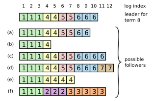
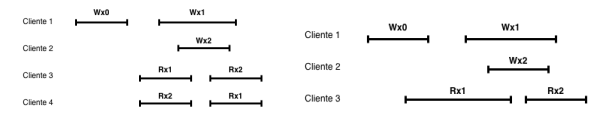

# Coloquio Integrador - Sistemas Distribuidos I

**Universidad de Buenos Aires - Facultad de Ingeniería**  
**TA050 Sistemas Distribuidos I - Cátedra Espina**  
**Coloquio integrador: 16/12/2025**

---

## 1. MapReduce

**Pregunta:**  
Para la tolerancia a fallos, la estrategia principal de MapReduce para garantizar que el resultado final sea el mismo que una ejecución secuencial no fallida es el uso de un protocolo de compromiso de dos fases (*two-phase commit*) para las salidas de Map y Reduce.

<details>
<summary><strong>Ver respuesta</strong></summary>

**La afirmación es falsa.**

La principal estrategia de MapReduce para garantizar que el resultado final sea el mismo que una ejecución secuencial no fallida, incluso ante fallos, es la **re-ejecución de tareas** y el uso de **commits atómicos** para la salida de las tareas, no un protocolo de compromiso de dos fases.

Cuando los operadores `map` y `reduce` son deterministas, la implementación distribuida de MapReduce produce la misma salida que una ejecución secuencial no fallida, basándose en commits atómicos de las salidas de las tareas `map` y `reduce`.

Una tarea `map` en progreso escribe su salida en archivos temporales privados, uno por cada tarea `reduce`. Cuando finaliza, el trabajador envía al master los nombres de esos archivos temporales. El master registra esos archivos y, si recibe un mensaje duplicado de finalización para una tarea ya completada, lo ignora.

Una tarea `reduce` también escribe su salida en un archivo temporal privado. Cuando termina, renombra atómicamente ese archivo temporal al archivo de salida final. Si la misma tarea `reduce` se ejecuta en varias máquinas, el sistema se apoya en el renombrado atómico del sistema de archivos subyacente para garantizar que el archivo final contenga solo los datos producidos por una ejecución.

Por lo tanto, MapReduce usa commits atómicos, re-ejecución de tareas y renombrado atómico, no un protocolo distribuido de *two-phase commit* para coordinar las salidas.

</details>

---

## 2. GFS

**Pregunta:**  
En GFS, la escritura de datos es completamente atómica y garantiza que no haya inconsistencias, incluso en caso de fallos de red o de disco.

<details>
<summary><strong>Ver respuesta</strong></summary>

**La afirmación es falsa.**

GFS utiliza un **modelo de consistencia relajada**. No garantiza que toda región de archivo sea completamente atómica ni libre de inconsistencias, especialmente ante fallos o escrituras concurrentes.

Puntos clave:

1. **Modelo de consistencia relajada:** GFS simplifica el sistema aceptando garantías de consistencia más débiles que la consistencia estricta.
2. **Escrituras tradicionales y fallos:** una escritura normal en la que el cliente especifica el offset, si falla, puede dejar la región del archivo en un estado inconsistente e indefinido. Distintos clientes pueden observar datos distintos.
3. **Escrituras concurrentes:** incluso si las escrituras concurrentes tienen éxito, la región afectada puede quedar consistente pero indefinida: todos ven los mismos datos, pero esos datos pueden ser una mezcla de múltiples mutaciones.
4. **Record append:** GFS ofrece una operación de `record append` que añade datos atómicamente al menos una vez. Sin embargo, ante fallos, las réplicas de un mismo chunk pueden contener datos diferentes, incluyendo duplicados completos o parciales.

En resumen, GFS no promete atomicidad completa ni ausencia total de inconsistencias para todas las escrituras ante fallos.

</details>

---

## 3. Raft

**Pregunta:**  
El objetivo principal al diseñar Raft fue lograr la máxima eficiencia en la replicación del log, superando las limitaciones de rendimiento inherentes al enfoque simétrico *peer-to-peer* de Paxos.

<details>
<summary><strong>Ver respuesta</strong></summary>

**La afirmación es falsa.**

El objetivo principal de Raft no fue maximizar la eficiencia, sino lograr **comprensibilidad** (*understandability*).

Raft fue diseñado para ser un algoritmo de consenso más fácil de aprender y entender que Paxos, manteniendo al mismo tiempo una base adecuada para construir sistemas prácticos.

Aunque Raft tiene rendimiento comparable al de otros algoritmos de consenso, como Paxos, su meta principal fue que el algoritmo fuera claro y que resultara evidente por qué funciona. Para ello, Raft adopta un enfoque de **liderazgo fuerte** (*strong leader*), en el que las entradas del log fluyen desde el líder hacia los seguidores. Este diseño simplifica la gestión del log replicado.

Por lo tanto, la eficiencia es importante en Raft, pero el objetivo primordial fue la comprensibilidad.

</details>

---

## 4. Raft

**Pregunta:**  
En Raft, si un *follower* tiene entradas que no coinciden con el log del líder, el líder forzará que el *follower* borre esas entradas conflictivas y las reemplace por las del líder.

<details>
<summary><strong>Ver respuesta</strong></summary>

**La afirmación es verdadera.**

En Raft, el líder mantiene la consistencia del log replicado. Si un seguidor tiene entradas que difieren de las del líder, el líder fuerza la convergencia de los logs.

El mecanismo es el siguiente:

1. El líder busca la última entrada en la que su log y el log del seguidor coinciden.
2. El seguidor elimina las entradas posteriores a ese punto si son conflictivas.
3. El líder envía al seguidor las entradas correctas a partir de ese punto.

Para esto, el líder mantiene un índice llamado `nextIndex` para cada seguidor. Si un `AppendEntries` falla por inconsistencia, el líder decrementa `nextIndex` y vuelve a intentar hasta encontrar un punto común. Cuando el RPC tiene éxito, las entradas conflictivas del seguidor son eliminadas y reemplazadas por las del líder.

En resumen, en caso de conflicto, Raft hace que el log del seguidor termine coincidiendo con el log del líder después del punto de coincidencia.

</details>

---

## 5. ZooKeeper

**Pregunta:**  
Para garantizar la alta disponibilidad y escalabilidad, las peticiones de escritura (*write requests*) en ZooKeeper se procesan localmente en cada servidor y se ordenan posteriormente utilizando el protocolo de *atomic broadcast* Zab.

<details>
<summary><strong>Ver respuesta</strong></summary>

**La afirmación es falsa.**

En ZooKeeper, las peticiones de escritura no se procesan localmente en cada servidor. Las escrituras son dirigidas al **líder**, quien luego usa Zab para replicarlas y establecer un orden total.

ZooKeeper distingue entre lecturas y escrituras:

- Las **lecturas** pueden ser satisfechas localmente por cualquier servidor. Esto favorece la escalabilidad en cargas dominadas por lecturas.
- Las **escrituras** o actualizaciones deben pasar por un protocolo de acuerdo para garantizar atomicidad y serialización.

Las peticiones de actualización son reenviadas al líder. El líder ejecuta la solicitud y transmite el cambio de estado a los demás servidores mediante Zab. Los seguidores reciben las propuestas de cambio y acuerdan el orden.

Por lo tanto, Zab se usa para ordenar y replicar escrituras, pero las escrituras no se procesan localmente en cada servidor.

</details>

---

## 6. Memcache

**Pregunta:**  
Para mitigar el problema de *thundering herds*, Facebook implementó un mecanismo de *leases* que asegura que solo una solicitud de cliente a la vez tenga permiso para acceder a la base de datos para rellenar un ítem de caché.

<details>
<summary><strong>Ver respuesta</strong></summary>

**La afirmación es verdadera.**

Facebook implementó un mecanismo de **leases** en Memcache para mitigar el problema de los **thundering herds**.

El problema ocurre cuando una clave tiene mucha actividad de lectura y escritura. Las escrituras invalidan repetidamente valores recién cacheados, haciendo que muchas lecturas recurran a la base de datos.

Con leases, cuando ocurre un *cache miss*, la instancia de `memcached` entrega a un cliente un token de 64 bits. El servidor regula la tasa a la que entrega estos tokens. Por defecto, se devuelve un token como máximo una vez cada 10 segundos por clave.

Las solicitudes que llegan luego de emitido un token reciben una notificación especial para esperar brevemente. Como el cliente con el lease normalmente rellena la caché en pocos milisegundos, los demás clientes suelen encontrar el dato disponible al reintentar.

Así, se evita que muchos clientes accedan simultáneamente a la base de datos para rellenar el mismo ítem. En el experimento citado, los leases redujeron la tasa máxima de consultas a la base de datos de 17K/s a 1.3K/s para claves susceptibles a *thundering herds*.

</details>

---

## 7. Dynamo

**Pregunta:**  
Dynamo utiliza relojes vectoriales para detectar concurrencia entre versiones de un objeto. Ante versiones concurrentes, es decir, ante la escritura de dos versiones de un mismo objeto no relacionadas causalmente, la reconciliación de las ramas se realiza siempre dentro del sistema Dynamo, de forma automática y transparente para el cliente, basándose únicamente en los relojes vectoriales.

<details>
<summary><strong>Ver respuesta</strong></summary>

**La afirmación es falsa.**

Dynamo sí utiliza **relojes vectoriales** para capturar causalidad y detectar concurrencia entre versiones de un objeto. Sin embargo, la reconciliación de versiones concurrentes no siempre se realiza automáticamente dentro del sistema ni es siempre transparente para el cliente.

Los relojes vectoriales permiten determinar si dos versiones están causalmente relacionadas o si pertenecen a ramas paralelas.

Dynamo puede hacer reconciliación sintáctica cuando una nueva versión subsume a versiones anteriores. Pero cuando hay conflictos verdaderos, por ejemplo por fallos combinados con actualizaciones concurrentes, el sistema puede no saber cómo fusionar semánticamente las versiones.

En esos casos, la reconciliación debe ser asistida por la aplicación o por el cliente. El cliente recibe múltiples versiones concurrentes y debe fusionarlas antes de realizar una nueva escritura.

Por lo tanto, Dynamo detecta conflictos con relojes vectoriales, pero no siempre los resuelve automáticamente de forma transparente.

</details>

---

## 8. DynamoDB

**Pregunta:**  
La principal distinción arquitectónica de las transacciones en DynamoDB es que tanto las operaciones transaccionales como las no transaccionales, por ejemplo `GetItem` o `PutItem`, deben pasar por el Coordinador de Transacciones (*Transaction Coordinator*) para ser serializadas.

<details>
<summary><strong>Ver respuesta</strong></summary>

**La afirmación es falsa.**

La arquitectura de transacciones de DynamoDB se basa precisamente en que las operaciones no transaccionales evitan el Coordinador de Transacciones para mantener eficiencia y baja latencia.

Las operaciones no transaccionales, como `GetItem` y `PutItem`, se ejecutan directamente en los servidores de almacenamiento que contienen los datos. No pasan por el Coordinador de Transacciones ni por el protocolo completo de coordinación de dos fases.

Esto es importante porque obligar a las operaciones simples y frecuentes a usar el protocolo de transacciones tendría un impacto demasiado alto en su rendimiento.

Las operaciones transaccionales, como `TransactGetItems` y `TransactWriteItems`, sí pasan por el Coordinador de Transacciones. El coordinador asigna un timestamp y ejecuta un protocolo distribuido con los nodos de almacenamiento para garantizar atomicidad y serialización.

En resumen, DynamoDB separa la ruta transaccional de la ruta no transaccional: las transacciones usan el Coordinador de Transacciones, mientras que las operaciones simples lo evitan.

</details>

---

## 9. Raft

**Pregunta:**  
En la figura se muestra un clúster Raft compuesto por 7 nodos. El líder actual se encuentra identificado explícitamente, mientras que los *followers* están rotulados con letras.

Suponga que el líder falla de manera abrupta. Indique cuáles de los *followers* podrían resultar elegidos como nuevo líder en la elección subsiguiente, de acuerdo con las reglas del algoritmo Raft. Justifique su respuesta.



<details>
<summary><strong>Ver respuesta</strong></summary>

**Podrían ser elegidos los followers (a), (c) y (d).**

La regla relevante es la restricción de seguridad de Raft llamada **Log Completeness**. Para votar a un candidato, un servidor verifica que el log del candidato esté al menos tan actualizado como el suyo.

Criterio de log más actualizado:

1. Si los logs terminan con términos diferentes, el log con el término final más reciente es más actualizado.
2. Si terminan con el mismo término, el log más largo, es decir, con mayor índice final, es más actualizado.

Como el clúster tiene 7 nodos, se necesita mayoría de 4 votos. Luego de fallar el líder, quedan 6 followers que pueden votar.

- **Follower (a)**: último término 6, índice 9. Puede recibir votos de sí mismo y de nodos con logs menos actualizados, como (b), (e) y (f). Llega a 4 votos, por lo tanto puede ser elegido.
- **Follower (c)**: último término 6, índice 11. Es más actualizado que (a), (b), (e) y (f), y puede recibir esos votos además del propio. Puede ser elegido.
- **Follower (d)**: último término 7, índice 12. Es el más actualizado de todos los followers, por lo que puede recibir votos de todos. Puede ser elegido.
- **Follower (b)**: no puede llegar a mayoría porque su log es demasiado atrasado.
- **Follower (e)**: tampoco llega a mayoría.
- **Follower (f)**: tiene un último término menor que los demás candidatos relevantes, por lo que no puede obtener mayoría.

Por lo tanto, los posibles nuevos líderes son **(a), (c) y (d)**.

</details>

---

## 10. Linealizabilidad

**Pregunta:**  
Para las siguientes historias de ejecución, indique si representan una ejecución linealizable y, de serlo, indique un posible orden secuencial equivalente de operaciones. Justifique su respuesta.



<details>
<summary><strong>Ver respuesta</strong></summary>

### Historia 1

**No es linealizable.**

La historia no puede ordenarse en una única secuencia que respete el orden real y que explique los valores leídos por todos los clientes.

El problema es que los clientes observan órdenes incompatibles entre las escrituras `Wx1` y `Wx2`:

- Un cliente observa primero `Rx1` y luego `Rx2`, lo que sugiere que `Wx1` ocurre antes que `Wx2`.
- Otro cliente observa primero `Rx2` y luego `Rx1`, lo que sugiere que `Wx2` ocurre antes que `Wx1`.

Ambas relaciones no pueden cumplirse simultáneamente en un único orden secuencial linealizable.

### Historia 2

**Sí es linealizable.**

Un posible orden secuencial equivalente es:

```text
Wx0 -> Wx1 -> Rx1 -> Wx2 -> Rx2
```

Este orden respeta el orden real de las operaciones y explica los valores leídos: primero se escribe 0, luego 1, luego la lectura observa 1, después se escribe 2 y finalmente la siguiente lectura observa 2.

### Principio usado

Cada llamada a un método debe parecer que surte efecto instantáneamente en algún punto entre su invocación y su respuesta. Ese instante se llama **punto de linealización**.

La linealizabilidad exige preservar:

1. El orden en tiempo real entre operaciones no solapadas.
2. El comportamiento secuencial observado por los procesos.

</details>

